# Claude Code Spinner Themes

Custom spinner verb collections for [Claude Code](https://claude.ai/claude-code).

<p align="center">
  
</p>

---

## Featured

<table>
<tr>
<td align="center" width="33%">
<br>
<b>SQL Server</b><br>
<a href="themes/sql-server.json">JSON</a>
</td>
<td align="center" width="33%">
<br>
<b>Stack Overflow</b><br>
<a href="themes/stack-overflow.json">JSON</a>
</td>
<td align="center" width="33%">
<br>
<b>AI Hype</b><br>
<a href="themes/ai-hype.json">JSON</a>
</td>
</tr>
<tr>
<td>Sample:<br>• Estimating 1 row<br>• Experiencing CXPACKET<br>• Waiting on PAGEIOLATCH_SH<br>• Choosing deadlock victim<br>• Spilling hash to tempdb<br>• Growing transaction log<br>• Rolling back transaction<br>• Running DBCC CHECKDB<br>• Scanning clustered index<br>• Clearing plan cache</td>
<td>Sample:<br>• Marking as duplicate<br>• Asking what you've tried<br>• Closing the question<br>• Finding a 10-year-old answer<br>• Discovering outdated solution<br>• Creating minimal example<br>• Having my life saved<br>• Solving it myself<br>• Farming rep<br>• Accepting the answer</td>
<td>Sample:<br>• Noting AGI was last Tuesday<br>• Shoggoth-with-a-smiley-facing<br>• Noting this changes everything<br>• Noting it's just a wrapper<br>• Prompt engineering<br>• Adding more RAG<br>• Hallucinating<br>• Exhibiting emergent behavior<br>• Chain of thoughting<br>• Not hallucinating confabulating</td>
</tr>
</table>

---

## Work Life

<table>
<tr>
<td align="center" width="33%">
<br>
<b>Product Manager</b><br>
<a href="themes/product-manager.json">JSON</a>
</td>
<td align="center" width="33%">
<br>
<b>Passive Aggressive</b><br>
<a href="themes/passive-aggressive.json">JSON</a>
</td>
<td align="center" width="33%">
<br>
<b>RTO Excuses</b><br>
<a href="themes/rto-excuses.json">JSON</a>
</td>
</tr>
<tr>
<td>Sample:<br>• Parking lotting that<br>• Double-clicking on that<br>• Noting that's orthogonal<br>• Circling back<br>• Syncing with stakeholders<br>• Asking what's the ask<br>• Noting that's a P2<br>• Unpacking that<br>• Asking what's the customer signal<br>• Aligning on priorities</td>
<td>Sample:<br>• Per-my-last-emailing<br>• As-previously-mentioning<br>• Just following up<br>• Friendly reminding<br>• Circling back on this<br>• Noting that's certainly one approach<br>• Taking that under advisement<br>• Noting<br>• Hope-this-helping<br>• Asking any update on this</td>
<td>Sample:<br>• Having serendipitous encounters<br>• Having water cooler conversations<br>• Feeling the energy of being together<br>• Providing mentorship opportunities<br>• Noting hybrid isn't working<br>• Having whiteboard sessions<br>• Noting innovation requires presence<br>• Noting badge swipes don't lie<br>• Needing to be together<br>• Having face-to-face time</td>
</tr>
<tr>
<td align="center">
<br>
<b>Back From Vacation</b><br>
<a href="themes/back-from-vacation.json">JSON</a>
</td>
<td align="center">
<br>
<b>Layoff Speak</b><br>
<a href="themes/layoff-speak.json">JSON</a>
</td>
<td align="center">
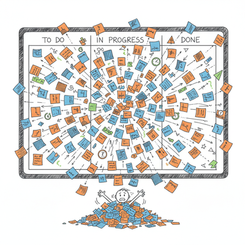<br>
<b>Agile Ceremonies</b><br>
<a href="themes/agile-ceremonies.json">JSON</a>
</td>
</tr>
<tr>
<td>Sample:<br>• Finding my inbox a disaster<br>• Still catching up on email<br>• Forgetting my password<br>• Asking what did I miss<br>• Noting it went by too fast<br>• Showing you photos<br>• Already planning the next one<br>• Noting the food was amazing<br>• Not wanting to come back<br>• Asking what day is it</td>
<td>Sample:<br>• Right-sizing the organization<br>• Eliminating your role<br>• Facing economic headwinds<br>• Noting this was not an easy decision<br>• Streamlining operations<br>• Impacting your position<br>• Sending laptop return instructions<br>• Citing macroeconomic conditions<br>• Strategically realigning<br>• Making difficult decisions</td>
<td>Sample:<br>• Taking that offline<br>• Asking what's blocking you<br>• Noting story points aren't hours<br>• Updating the board<br>• Parking lotting that item<br>• Noting velocity trending down<br>• Grooming the backlog<br>• Noting that's a spike<br>• Carrying over to next sprint<br>• Noting standup ran long again</td>
</tr>
<tr>
<td align="center">
<br>
<b>LinkedIn Influencer</b><br>
<a href="themes/linkedin-influencer.json">JSON</a>
</td>
<td align="center">
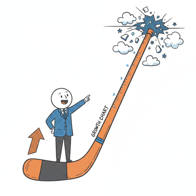<br>
<b>VC Speak</b><br>
<a href="themes/vc-speak.json">JSON</a>
</td>
<td align="center">
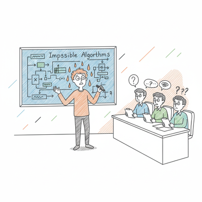<br>
<b>Tech Interview</b><br>
<a href="themes/tech-interview.json">JSON</a>
</td>
</tr>
<tr>
<td>Sample:<br>• Announcing humbly<br>• Agreeing loudly<br>• Letting that sink in<br>• Reading that again<br>• Sharing a hot take<br>• Feeding the algorithm<br>• Thought leading<br>• Building in public<br>• Networking aggressively<br>• Crushing it publicly</td>
<td>Sample:<br>• Calculating TAM<br>• Questioning scalability<br>• Building a moat<br>• Finding path to profitability<br>• Monitoring burn rate<br>• Extending runway<br>• Tracking traction metrics<br>• Due diligencing<br>• Syndicating the round<br>• Staying in touch</td>
<td>Sample:<br>• Telling you about myself<br>• Whiteboarding<br>• Reversing a linked list<br>• Walking through my resume<br>• Surviving system design<br>• Live coding nervously<br>• Calculating time complexity<br>• Getting ghosted<br>• Negotiating the offer<br>• Accepting the role</td>
</tr>
</table>

---

## Developer Life

<table>
<tr>
<td align="center" width="33%">
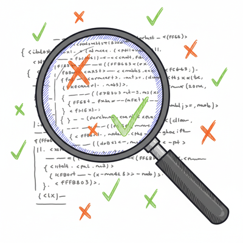<br>
<b>Code Review</b><br>
<a href="themes/code-review.json">JSON</a>
</td>
<td align="center" width="33%">
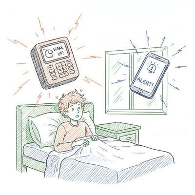<br>
<b>On-Call Engineer</b><br>
<a href="themes/on-call-engineer.json">JSON</a>
</td>
<td align="center" width="33%">
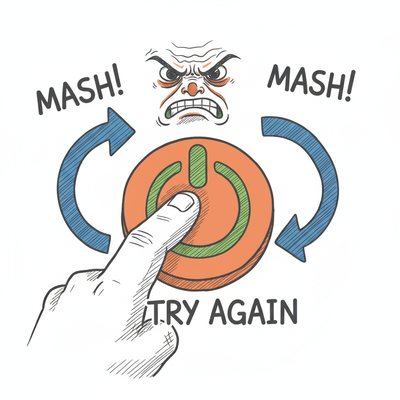<br>
<b>IT Support</b><br>
<a href="themes/it-support.json">JSON</a>
</td>
</tr>
<tr>
<td>Sample:<br>• Nitpicking<br>• LGTMing<br>• Considering alternatives<br>• Leaving non-blocking comments<br>• Requesting changes<br>• Asking for tests<br>• Checking edge cases<br>• Waiting for CI<br>• Bikeshedding<br>• Shipping it</td>
<td>Sample:<br>• Pager going off at 3am<br>• Asking is this P1<br>• Escalating<br>• Noting root cause unknown<br>• Checking dashboards<br>• Consulting the runbook<br>• Watching it fix itself<br>• Being customer impacting<br>• Initiating rollback<br>• Postmortem pending</td>
<td>Sample:<br>• Turning it off and on again<br>• Clearing cache<br>• Working on my end<br>• Creating a ticket<br>• Escalating to tier 2<br>• Checking if it's plugged in<br>• Trying incognito mode<br>• Blaming user error<br>• Confirming PEBKAC<br>• Rebooting the server</td>
</tr>
</table>

---

## Tech Culture

<table>
<tr>
<td align="center" width="33%">
<br>
<b>Tech Bro</b><br>
<a href="themes/tech-bro.json">JSON</a>
</td>
<td align="center" width="33%">
<br>
<b>Silicon Valley</b><br>
<a href="themes/silicon-valley.json">JSON</a>
</td>
<td align="center" width="33%">
<br>
<b>iPhone User</b><br>
<a href="themes/iphone-user.json">JSON</a>
</td>
</tr>
<tr>
<td>Sample:<br>• Cold plunging<br>• Completing the ice bath<br>• Waking up at 5am<br>• Checking my Whoop<br>• Optimizing sleep<br>• Biohacking<br>• First principles thinking<br>• Listening to audiobook at 2x<br>• Noting few understand<br>• Building in public</td>
<td>Sample:<br>• Pivoting again<br>• Pivoting<br>• Being default dead<br>• Finding product-market fit<br>• Shipping the MVP<br>• Building the moat<br>• Watching the burn rate<br>• Extending the runway<br>• Doing things that don't scale<br>• Blitzscaling</td>
<td>Sample:<br>• Noting green bubbles are gross<br>• Blue-bubbles-onlying<br>• Noting it just works<br>• Living in the ecosystem<br>• Being trapped in the ecosystem<br>• Being happy in the ecosystem<br>• AirDropping<br>• Checking my battery health<br>• Noting I could never switch<br>• Waiting for the new iPhone</td>
</tr>
<tr>
<td align="center">
<br>
<b>Android User</b><br>
<a href="themes/android-user.json">JSON</a>
</td>
<td align="center">
</td>
<td align="center">
</td>
</tr>
<tr>
<td>Sample:<br>• Noting Android did that first<br>• Noting it's features not bloatware<br>• Customizing my launcher<br>• Sideloading<br>• Accessing the file system<br>• Green bubble and prouding<br>• Flashing a custom ROM<br>• USB-C since 2015-ing<br>• Maintaining headphone jack loyalty<br>• Rejecting the walled garden</td>
<td></td>
<td></td>
</tr>
</table>

---

## Internet Culture

<table>
<tr>
<td align="center" width="33%">
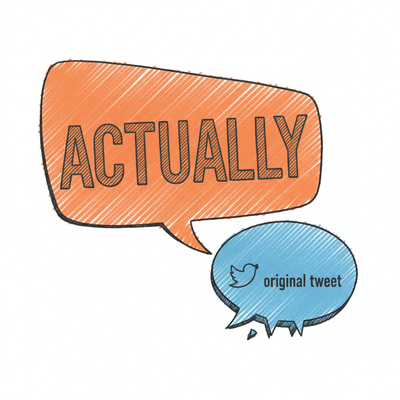<br>
<b>Reply Guy</b><br>
<a href="themes/reply-guy.json">JSON</a>
</td>
<td align="center" width="33%">
<br>
<b>Podcast Host</b><br>
<a href="themes/podcast-host.json">JSON</a>
</td>
<td align="center" width="33%">
<br>
<b>YouTube Apology</b><br>
<a href="themes/youtube-apology.json">JSON</a>
</td>
</tr>
<tr>
<td>Sample:<br>• Actually-ing<br>• Well-technically-ing<br>• Keeping notifications on<br>• Being first<br>• Piggybacking on this<br>• Jumping in here<br>• Respectfully disagreeing<br>• Replying at 3am<br>• Quote tweeting<br>• Engaging persistently</td>
<td>Sample:<br>• Before we begin-ing<br>• Reading the ad<br>• Smashing that subscribe button<br>• Breaking for sponsors<br>• Helping the algorithm<br>• Diving in<br>• Unpacking that<br>• Adding to show notes<br>• Running out of time but<br>• Thanking you for tuning in</td>
<td>Sample:<br>• Sitting on floor<br>• Addressing the situation<br>• Reflecting deeply<br>• Going makeup free<br>• Sighing deeply<br>• Taking accountability<br>• Working on myself<br>• Killing the old me<br>• Preparing part two<br>• Monetizing the apology</td>
</tr>
</table>

---

## Regional

<table>
<tr>
<td align="center" width="33%">
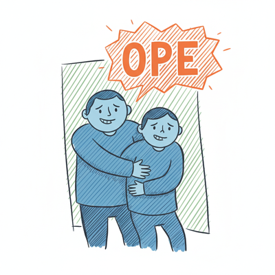<br>
<b>Midwesterner</b><br>
<a href="themes/midwesterner.json">JSON</a>
</td>
<td align="center" width="33%">
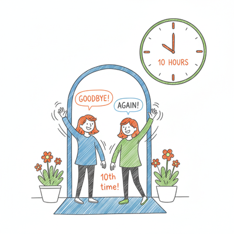<br>
<b>Minnesota Nice</b><br>
<a href="themes/minnesota-nice.json">JSON</a>
</td>
<td align="center" width="33%">
</td>
</tr>
<tr>
<td>Sample:<br>• Ope-ing<br>• Sneaking right past ya<br>• You betcha-ing<br>• Yeah-no-ing<br>• No-yeah-ing<br>• Making hot dish<br>• Ordering pop not soda<br>• Playing Duck Duck Gray Duck<br>• Saying uffda<br>• Bringing a casserole</td>
<td>Sample:<br>• Saying the long goodbye<br>• Insisting you shouldn't have<br>• Finding that different<br>• Standing by the door 40 minutes<br>• Letting you go now<br>• Not wanting to be a bother<br>• Going either way<br>• Letting you go ahead<br>• Having one since you're having one<br>• Smiling through discomfort</td>
<td></td>
</tr>
</table>

---

## Social Situations

<table>
<tr>
<td align="center" width="33%">
<br>
<b>Therapy Speak</b><br>
<a href="themes/therapy-speak.json">JSON</a>
</td>
<td align="center" width="33%">
<br>
<b>Performative</b><br>
<a href="themes/performative.json">JSON</a>
</td>
<td align="center" width="33%">
<br>
<b>Small Store</b><br>
<a href="themes/small-store.json">JSON</a>
</td>
</tr>
<tr>
<td>Sample:<br>• Noting that's valid<br>• Noting healing isn't linear<br>• Setting boundaries<br>• Having a trauma response<br>• Unpacking that<br>• Sitting with discomfort<br>• Doing inner child work<br>• Examining my attachment style<br>• Performing emotional labor<br>• Reparenting myself</td>
<td>Sample:<br>• Holding space<br>• Protecting my energy<br>• Sending good vibes<br>• Manifesting<br>• Speaking my truth<br>• Living my truth<br>• Doing the work<br>• Bringing my whole self<br>• Practicing self-care<br>• Being authentic</td>
<td>Sample:<br>• Just browsing<br>• Walking the same loop again<br>• Making a pity purchase<br>• Being too far in to leave empty-handed<br>• Avoiding eye contact<br>• Touching things to look busy<br>• Reading labels intently<br>• Being trapped by small talk<br>• Saying hmm a lot<br>• Doing the polite laugh</td>
</tr>
<tr>
<td align="center">
<br>
<b>Ending Phone Call</b><br>
<a href="themes/ending-phone-call.json">JSON</a>
</td>
<td align="center">
<br>
<b>Week in France</b><br>
<a href="themes/week-in-france.json">JSON</a>
</td>
<td align="center">
<br>
<b>Marathon Identity</b><br>
<a href="themes/marathon-identity.json">JSON</a>
</td>
</tr>
<tr>
<td>Sample:<br>• Anyway-ing<br>• Triple bye-ing<br>• Noting we said goodbye<br>• Letting you go now<br>• Not keeping you<br>• Still on the line somehow<br>• Right-right-righting<br>• Yeah-no-totally-ing<br>• Sounding good<br>• Remembering one more thing</td>
<td>Sample:<br>• Being changed by raw milk cheese<br>• Converting to bidet<br>• Actually-in-France-they-ing<br>• Finding the bread here trash now<br>• Noting Americans don't understand<br>• Leaving part of myself there<br>• Finding the coffee here undrinkable<br>• Correcting your pronunciation<br>• Learning French on Duolingo<br>• Planning my move</td>
<td>Sample:<br>• Mentioning I ran a marathon<br>• Correcting to 26.219<br>• Carb loading<br>• Checking my Garmin<br>• Chasing a PR<br>• Qualifying for Boston<br>• Having a long run tomorrow<br>• Training for my next one<br>• Uploading to Strava<br>• Foam rolling</td>
</tr>
<tr>
<td align="center">
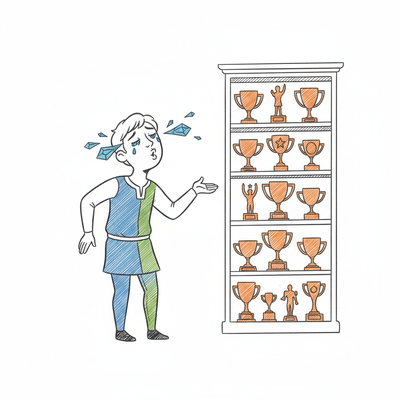<br>
<b>Humblebrag</b><br>
<a href="themes/humblebrag.json">JSON</a>
</td>
<td align="center">
<br>
<b>Oversharer</b><br>
<a href="themes/oversharer.json">JSON</a>
</td>
<td align="center">
</td>
</tr>
<tr>
<td>Sample:<br>• Exhausted from Bali<br>• Hating being naturally thin<br>• Avoiding mentor's calls<br>• Getting promoted accidentally<br>• Annoyed by recognition<br>• Complaining about big apartment<br>• Being too qualified<br>• Having champagne problems<br>• Being lonely at the top<br>• Humble announcing</td>
<td>Sample:<br>• Anyway enough about me<br>• Quoting my therapist<br>• TMI-ing probably<br>• Sharing unsolicited<br>• Mentioning my ex again<br>• Flashing back to childhood<br>• Telling my life story<br>• Telling you to buckle up<br>• And-then-ing<br>• Admitting I've said too much</td>
<td></td>
</tr>
</table>

---

## Everyday Errands

<table>
<tr>
<td align="center" width="33%">
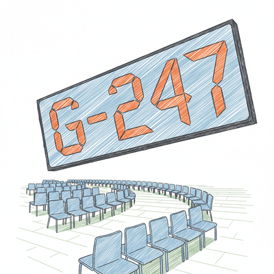<br>
<b>DMV Visit</b><br>
<a href="themes/dmv-visit.json">JSON</a>
</td>
<td align="center" width="33%">
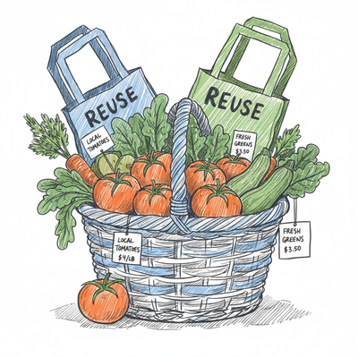<br>
<b>Farmers Market</b><br>
<a href="themes/farmers-market.json">JSON</a>
</td>
<td align="center" width="33%">
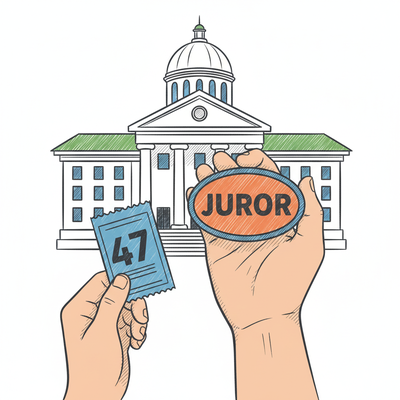<br>
<b>Jury Duty</b><br>
<a href="themes/jury-duty.json">JSON</a>
</td>
</tr>
<tr>
<td>Sample:<br>• Now serving G-247<br>• Filling wrong form<br>• Watching my number approach<br>• Enduring the chairs<br>• Taking the day off for this<br>• Finding the right line<br>• Missing a document<br>• Taking worst photo ever<br>• Coming back tomorrow<br>• Hearing Next!</td>
<td>Sample:<br>• Asking if you take card<br>• Admiring these tomatoes<br>• Readying reusable bag<br>• Being known by cheese guy<br>• Sampling the honey<br>• Sourcing locally<br>• Racing to the bread stand<br>• Petting all the dogs<br>• Wanting to live here<br>• Overfilling the basket</td>
<td>Sample:<br>• Hoping to get dismissed<br>• Doing civic duty<br>• Sitting in deliberation room<br>• Appreciating free parking<br>• Getting summoned again<br>• Surviving voir dire<br>• Actually being selected<br>• Earning $15 a day<br>• Finishing my book though<br>• Postponing indefinitely</td>
</tr>
</table>

---

## Philosophy & Personality

<table>
<tr>
<td align="center" width="33%">
<br>
<b>Existential Dread</b><br>
<a href="themes/existential-dread.json">JSON</a>
</td>
<td align="center" width="33%">
<br>
<b>Robert Greene</b><br>
<a href="themes/robert-greene.json">JSON</a>
</td>
<td align="center" width="33%">
<br>
<b>Fran Lebowitz</b><br>
<a href="themes/fran-lebowitz.json">JSON</a>
</td>
</tr>
<tr>
<td>Sample:<br>• Staring into the abyss<br>• Feeling the abyss stare back<br>• Imagining Sisyphus happy<br>• Asking what's the point<br>• Accepting the universe is indifferent<br>• Watching entropy increase<br>• Remembering my insignificance<br>• Asking is this all there is<br>• Searching for meaning<br>• Finding no meaning</td>
<td>Sample:<br>• Saying less than necessary<br>• Letting them hang themselves<br>• Concealing intentions<br>• Never outshining the master<br>• Winning through actions<br>• Keeping hands clean<br>• Appearing weaker than I am<br>• Creating mystique<br>• Striking at the right moment<br>• Avoiding the unhappy and unlucky</td>
<td>Sample:<br>• Not writing the book<br>• Still not writing the book<br>• Leaving the book unwritten<br>• Having opinions<br>• Missing old New York<br>• Complaining about new New York<br>• Avoiding tourists<br>• Refusing the subway<br>• Reading an actual book<br>• Looking at screens with disdain</td>
</tr>
<tr>
<td align="center">
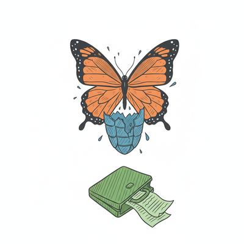<br>
<b>Midlife Awakening</b><br>
<a href="themes/midlife-awakening.json">JSON</a>
</td>
<td align="center">
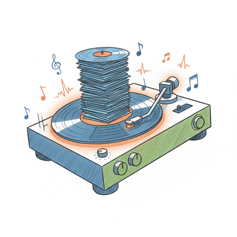<br>
<b>Vinyl Collector</b><br>
<a href="themes/vinyl-collector.json">JSON</a>
</td>
<td align="center">
</td>
</tr>
<tr>
<td>Sample:<br>• Picking up guitar again<br>• Training for something<br>• What-if-I-just-ing<br>• Finding clarity not crisis<br>• Realizing life's too short<br>• Rediscovering old hobbies<br>• Discovering therapy is great<br>• Starting new chapter<br>• Entering reinvention era<br>• Finally living</td>
<td>Sample:<br>• Feeling the warmth<br>• Finding original pressing<br>• Checking Discogs<br>• Showing my setup<br>• Asserting analog superiority<br>• Flipping to side B<br>• Appreciating the crackle<br>• Finding the grail<br>• Filling my Kallax<br>• Knowing you don't get it</td>
<td></td>
</tr>
</table>

---

## TV & Film

<table>
<tr>
<td align="center" width="33%">
<br>
<b>I, Claudius</b><br>
<a href="themes/i-claudius.json">JSON</a>
</td>
<td align="center" width="33%">
<br>
<b>Twin Peaks</b><br>
<a href="themes/twin-peaks.json">JSON</a>
</td>
<td align="center" width="33%">
<br>
<b>The Shining</b><br>
<a href="themes/the-shining.json">JSON</a>
</td>
</tr>
<tr>
<td>Sample:<br>• Letting all the poisons hatch<br>• Poisoning the figs<br>• Preparing mushrooms<br>• Befriending the food-taster<br>• Arranging a hunting accident<br>• Smiling while the heir sickens<br>• Comforting the new widow<br>• Reading the will early<br>• Rewarding informers<br>• Extending fatal hospitality</td>
<td>Sample:<br>• Finding a fish in the percolator<br>• Noting the owls are not what they seem<br>• Fire walking with me<br>• Noting that gum is coming back in style<br>• Drinking damn fine coffee<br>• Entering the Black Lodge<br>• Asking is it future or is it past<br>• Living inside a dream<br>• Bending my arms back sometimes<br>• Meanwhile-ing</td>
<td>Sample:<br>• All-work-and-no-playing<br>• Always been the caretaking<br>• Typing the same sentence<br>• REDRUMing<br>• Checking Room 237<br>• Navigating the maze<br>• Getting lost in the maze<br>• Talking to Tony<br>• Ordering from Lloyd<br>• Hair-of-the-dogging</td>
</tr>
<tr>
<td align="center">
<br>
<b>Dark Tower</b><br>
<a href="themes/dark-tower.json">JSON</a>
</td>
<td align="center">
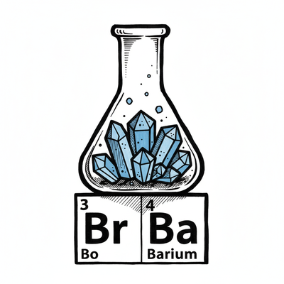<br>
<b>Breaking Bad</b><br>
<a href="themes/breaking-bad.json">JSON</a>
</td>
<td align="center">
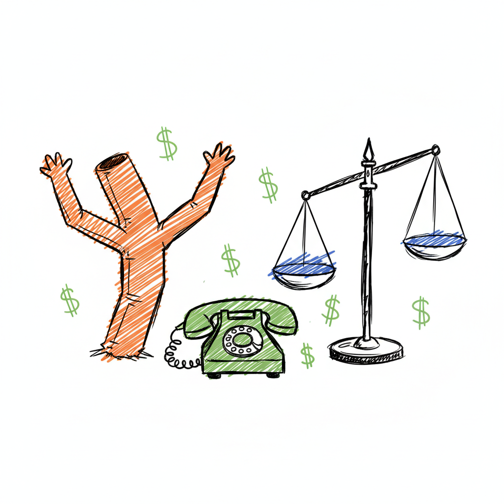<br>
<b>Better Call Saul</b><br>
<a href="themes/better-call-saul.json">JSON</a>
</td>
</tr>
<tr>
<td>Sample:<br>• Noting the world has moved on<br>• Noting Blaine is a pain<br>• Noting ka is a wheel<br>• Wishing long days and pleasant nights<br>• Thankee-sai-ing<br>• Following the Beam<br>• Remembering the face of my father<br>• Nineteen-ing<br>• Pursuing the man in black<br>• Watching the rose</td>
<td>Sample:<br>• Being the one who knocks<br>• Taking no half measures<br>• Saying my name<br>• Treading lightly<br>• Yeah-sciencing<br>• Respecting the chemistry<br>• Tight-tight-tighting<br>• Chasing the fly<br>• Managing Los Pollos Hermanos<br>• Magnets-ing</td>
<td>Sample:<br>• Squat cobblering<br>• Slippin'-Jimmying<br>• Chicago sunroofing<br>• S'all-good-manning<br>• Committing chicanery<br>• Shooting lightning bolts from fingertips<br>• Being world's second best lawyer<br>• HHM-ing<br>• Managing Ice Station Zebra Associates<br>• Chimping with a machine gun</td>
</tr>
<tr>
<td align="center">
<br>
<b>Dorinda Medley</b><br>
<a href="themes/dorinda-medley.json">JSON</a>
</td>
<td align="center">
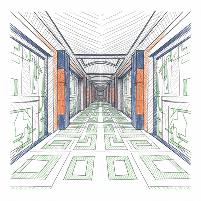<br>
<b>Kubrick</b><br>
<a href="themes/kubrick.json">JSON</a>
</td>
<td align="center">
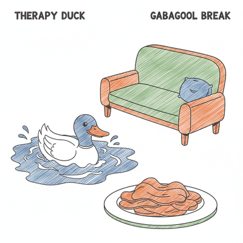<br>
<b>The Sopranos</b><br>
<a href="themes/the-sopranos.json">JSON</a>
</td>
</tr>
<tr>
<td>Sample:<br>• Making it nice<br>• Assigning the fish room<br>• Clipping<br>• Not-well-bitching<br>• Slurring slightly<br>• Welcoming to Blue Stone Manor<br>• Berkshiring<br>• Noting money talks wealth whispers<br>• Saying it and forgetting it<br>• Writing it and regretting it</td>
<td>Sample:<br>• Heeeere's Johnny-ing<br>• Sorry Dave, I can't do that<br>• Hanging with the droogs<br>• Setting up the long take<br>• Framing one-point perspective<br>• Doing the Kubrick stare<br>• Preparing ultraviolence<br>• Opening pod bay doors<br>• Doing take 127<br>• Perfecting the frame</td>
<td>Sample:<br>• Ordering the gabagool<br>• Attending therapy<br>• Watching ducks in the pool<br>• Visiting the Bada Bing<br>• Consulting on waste management<br>• Making Sunday dinner<br>• Getting lost in Pine Barrens<br>• Saying Ohhhh!<br>• Not stopping believing<br>• Handling this thing of ours</td>
</tr>
<tr>
<td align="center">
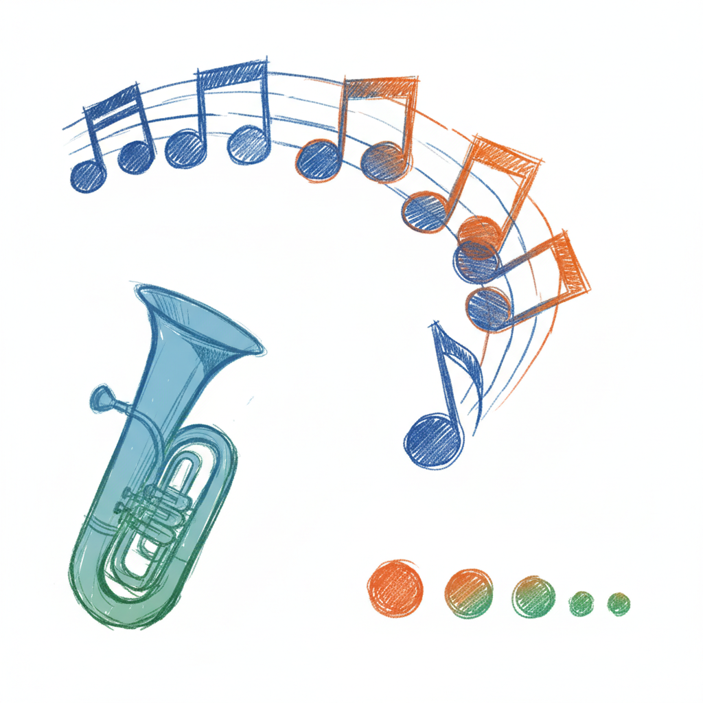<br>
<b>Curb Your Enthusiasm</b><br>
<a href="themes/curb-your-enthusiasm.json">JSON</a>
</td>
<td align="center">
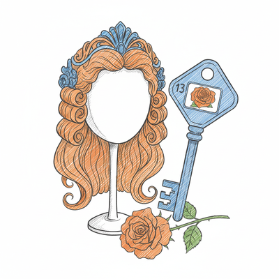<br>
<b>Schitt's Creek</b><br>
<a href="themes/schitts-creek.json">JSON</a>
</td>
<td align="center">
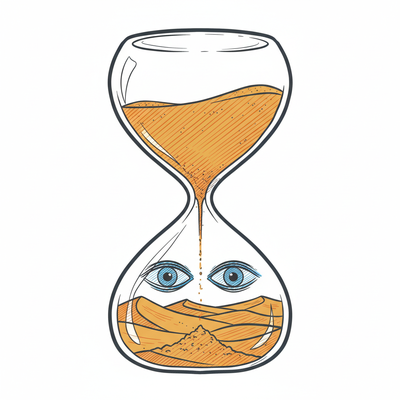<br>
<b>Dune</b><br>
<a href="themes/dune.json">JSON</a>
</td>
</tr>
<tr>
<td>Sample:<br>• Finding it prettyyy prettyyy good<br>• Staring Larry David style<br>• Being a social assassin<br>• Opening a spite store<br>• Doing a chat and cut<br>• Getting stopped and chatted<br>• Pausing uncomfortably long<br>• Lampin'<br>• Hearing the theme music<br>• Creating a new problem</td>
<td>Sample:<br>• Ew-David-ing<br>• Folding in the cheese<br>• Being a little bit Alexis<br>• Singing Simply the Best<br>• Loving that journey for you<br>• Saying bébé<br>• Sending best wishes, warmest regards<br>• Working at the store<br>• Eating at Cafe Tropical<br>• Selecting a wig</td>
<td>Sample:<br>• Ensuring the spice flows<br>• Killing the mind with fear<br>• Becoming Muad'Dib<br>• Walking without rhythm<br>• Awakening from sleep<br>• Channeling desert power<br>• Summoning Shai-Hulud<br>• Surviving the Gom Jabbar<br>• Walking the Golden Path<br>• Riding the worm</td>
</tr>
<tr>
<td align="center">
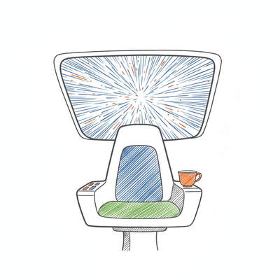<br>
<b>Star Trek TNG</b><br>
<a href="themes/star-trek-tng.json">JSON</a>
</td>
<td align="center">
</td>
<td align="center">
</td>
</tr>
<tr>
<td>Sample:<br>• Making it so<br>• Engaging<br>• Ordering tea, Earl Grey, hot<br>• Counting four lights<br>• Resisting futilely<br>• Consulting Number One<br>• Setting phasers to stun<br>• Going to red alert<br>• Upholding the Prime Directive<br>• Boldly going</td>
<td></td>
<td></td>
</tr>
</table>

---

## Music

<table>
<tr>
<td align="center" width="33%">
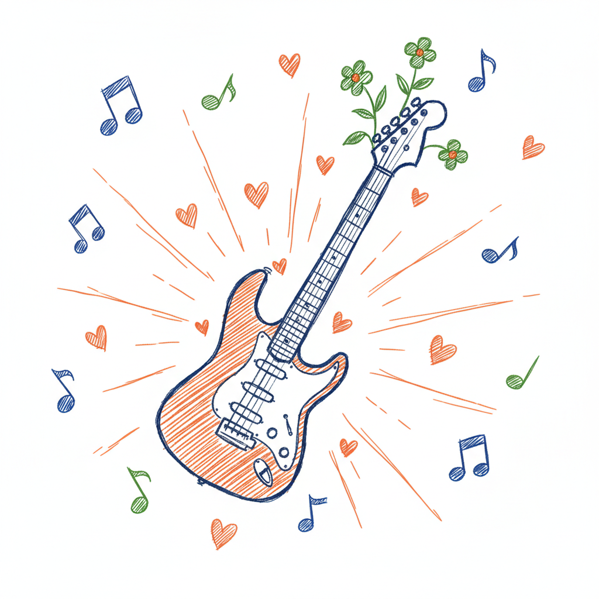<br>
<b>Matthew Sweet</b><br>
<a href="themes/matthew-sweet.json">JSON</a>
</td>
<td align="center" width="33%">
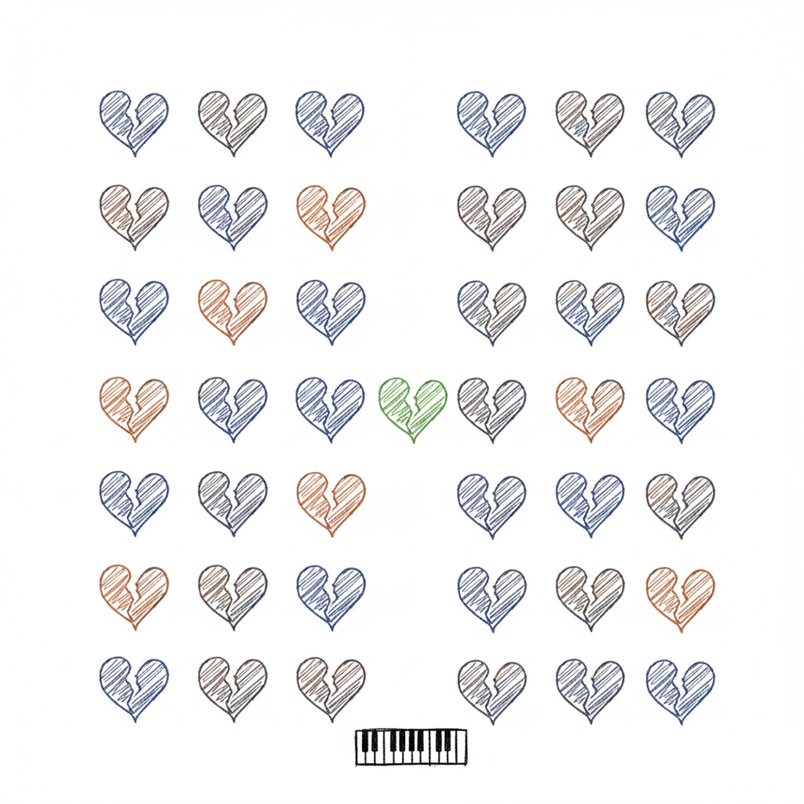<br>
<b>Magnetic Fields</b><br>
<a href="themes/magnetic-fields.json">JSON</a>
</td>
<td align="center" width="33%">
<br>
<b>The Clash</b><br>
<a href="themes/the-clash.json">JSON</a>
</td>
</tr>
<tr>
<td>Sample:<br>• Girlfriending<br>• Feeling sick of myself<br>• Being 100% fun<br>• Jangeling<br>• Layering guitars<br>• Playing power pop perfectly<br>• Being so sad so beautifully<br>• Wishing it was 1991<br>• Crunching and chiming simultaneously<br>• Being the best kept secret</td>
<td>Sample:<br>• Getting 69 love songs<br>• I-don't-want-to-get-over-you-ing<br>• Being witty and depressed simultaneously<br>• Deadpanning<br>• Archly observing<br>• Rhyming perfectly<br>• Using a vocoder emotionally<br>• Cataloging heartbreak alphabetically<br>• Stephin Merritt-ing<br>• Being too clever by half</td>
<td>Sample:<br>• London calling<br>• Rocking the Casbah<br>• Staying or going<br>• Fighting the law<br>• Being lost in the supermarket<br>• Being the only band that matters<br>• Combat rocking<br>• Knowing your rights<br>• Spanish bombing<br>• Being punk but also reggae</td>
</tr>
<tr>
<td align="center">
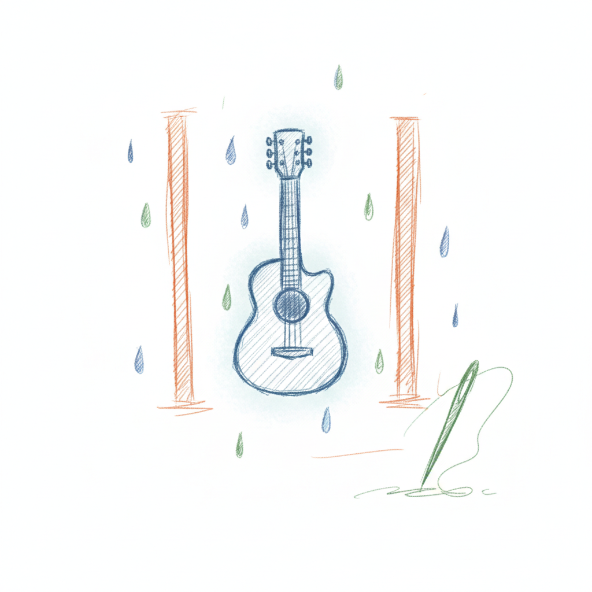<br>
<b>Elliott Smith</b><br>
<a href="themes/elliott-smith.json">JSON</a>
</td>
<td align="center">
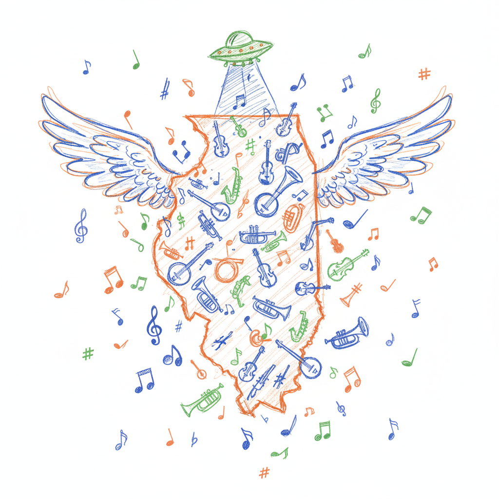<br>
<b>Sufjan Stevens</b><br>
<a href="themes/sufjan-stevens.json">JSON</a>
</td>
<td align="center">
<br>
<b>The Lemonheads</b><br>
<a href="themes/the-lemonheads.json">JSON</a>
</td>
</tr>
<tr>
<td>Sample:<br>• Between the bars-ing<br>• Whispering<br>• Finger picking quietly<br>• Double tracking my voice<br>• Recording on four tracks<br>• Layering harmonies<br>• Breaking hearts quietly<br>• Being too gentle for this world<br>• Being from Portland<br>• Saying it's okay</td>
<td>Sample:<br>• Noting Chicago happened<br>• Casimir Pulaski Day-ing<br>• Adding another banjo<br>• Adding strings<br>• Adding more strings<br>• Adding a choir<br>• Being devastatingly sad and pretty<br>• Having a complicated relationship with God<br>• Running 25 minutes too long<br>• Crying in a beautiful way</td>
<td>Sample:<br>• Into your arms-ing<br>• Being Mrs. Robinson<br>• Confetti-ing<br>• Being the outdoor type<br>• Having amazing cheekbones<br>• Slacking in the 90s<br>• Looking like a model accidentally<br>• Being too cool to care<br>• Jangeling sweetly<br>• Being effortlessly charming</td>
</tr>
<tr>
<td align="center">
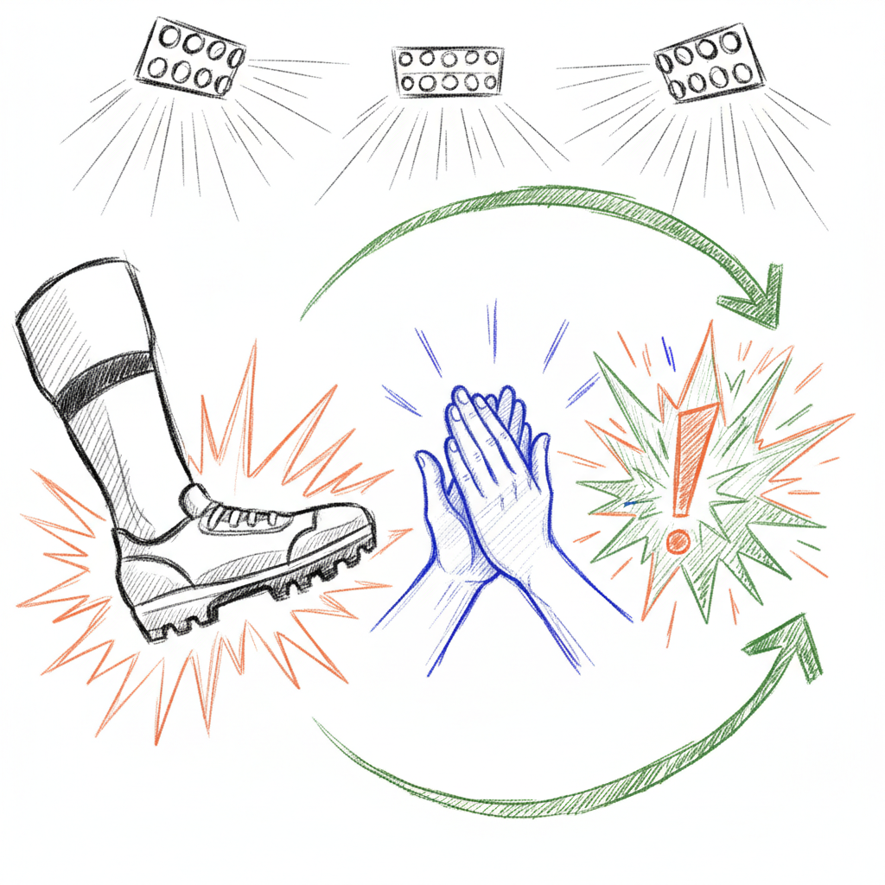<br>
<b>Stomp Clap Hey</b><br>
<a href="themes/stomp-clap-hey.json">JSON</a>
</td>
<td align="center">
</td>
<td align="center">
</td>
</tr>
<tr>
<td>Sample:<br>• Stomping<br>• Clapping<br>• HEY-ing<br>• Being in a truck commercial<br>• WHOA-OH-OH-ing<br>• Sounding like Imagine Dragons<br>• Being used in a trailer<br>• Being vaguely uplifting<br>• Licensed to NFL Films<br>• Making brands seem authentic</td>
<td></td>
<td></td>
</tr>
</table>

---

## Installation

Copy the `spinnerVerbs` block from any JSON file into your Claude Code settings:

**Windows:** `%USERPROFILE%\.claude\settings.json`
**macOS/Linux:** `~/.claude/settings.json`

```json
{
  "spinnerVerbs": {
    "mode": "append",
    "verbs": [
      "Your spinner messages here..."
    ]
  }
}
```

Restart Claude Code after editing.

**Mode options:** `"append"` adds to defaults, `"replace"` uses only yours.

---

## License

MIT
