# Claude Code Spinner Themes

Custom spinner verb collections for [Claude Code](https://claude.ai/claude-code).

---

## Themes

<table>
<tr>
<td align="center" width="33%">
<br>
<b>Passive Aggressive</b><br>
<i>"Per my last email" / "Noted"</i><br>
<a href="passive-aggressive.json">Download</a>
</td>
<td align="center" width="33%">
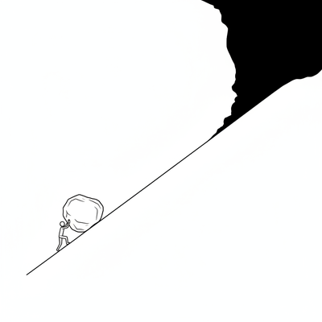<br>
<b>Existential Dread</b><br>
<i>"The abyss staring back" / "One must imagine Sisyphus happy"</i><br>
<a href="existential-dread.json">Download</a>
</td>
<td align="center" width="33%">
<br>
<b>AI Hype</b><br>
<i>"AGI was last Tuesday" / "Shoggoth with a smiley face"</i><br>
<a href="ai-hype.json">Download</a>
</td>
</tr>
<tr>
<td align="center">
<br>
<b>Robert Greene</b><br>
<i>"Saying less than necessary" / "Letting them hang themselves"</i><br>
<a href="robert-greene.json">Download</a>
</td>
<td align="center">
<br>
<b>Fran Lebowitz</b><br>
<i>"Still not writing the book" / "No one listens"</i><br>
<a href="fran-lebowitz.json">Download</a>
</td>
<td align="center">
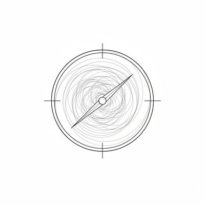<br>
<b>Silicon Valley</b><br>
<i>"Pivoting again" / "Default dead"</i><br>
<a href="silicon-valley.json">Download</a>
</td>
</tr>
<tr>
<td align="center">
<br>
<b>Tech Bro</b><br>
<i>"Cold plunge" / "Few understand"</i><br>
<a href="tech-bro.json">Download</a>
</td>
<td align="center">
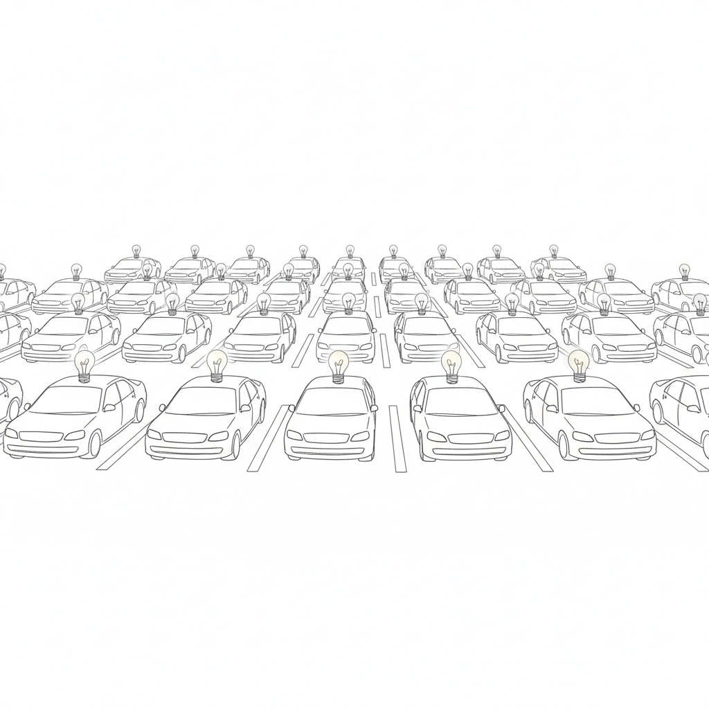<br>
<b>Product Manager</b><br>
<i>"Parking lot that" / "Double-clicking on that"</i><br>
<a href="product-manager.json">Download</a>
</td>
<td align="center">
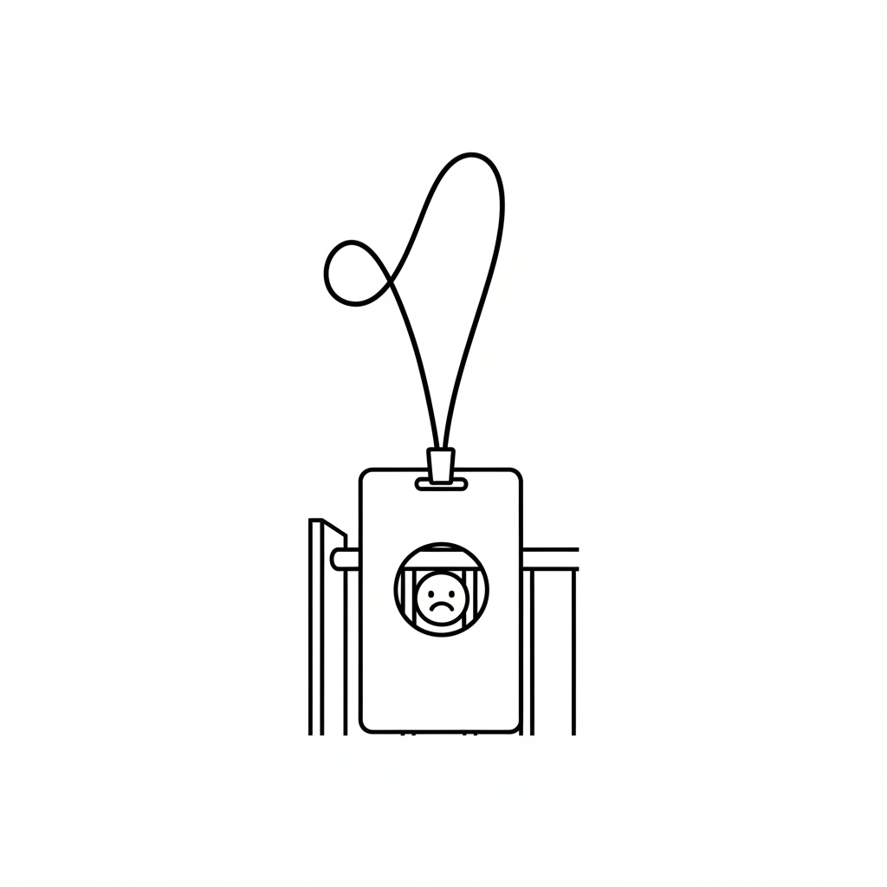<br>
<b>RTO Excuses</b><br>
<i>"Serendipitous encounters" / "Badge swipes don't lie"</i><br>
<a href="rto-excuses.json">Download</a>
</td>
</tr>
<tr>
<td align="center">
<br>
<b>Back From Vacation</b><br>
<i>"Okay I checked email constantly" / "I forgot my password"</i><br>
<a href="back-from-vacation.json">Download</a>
</td>
<td align="center">
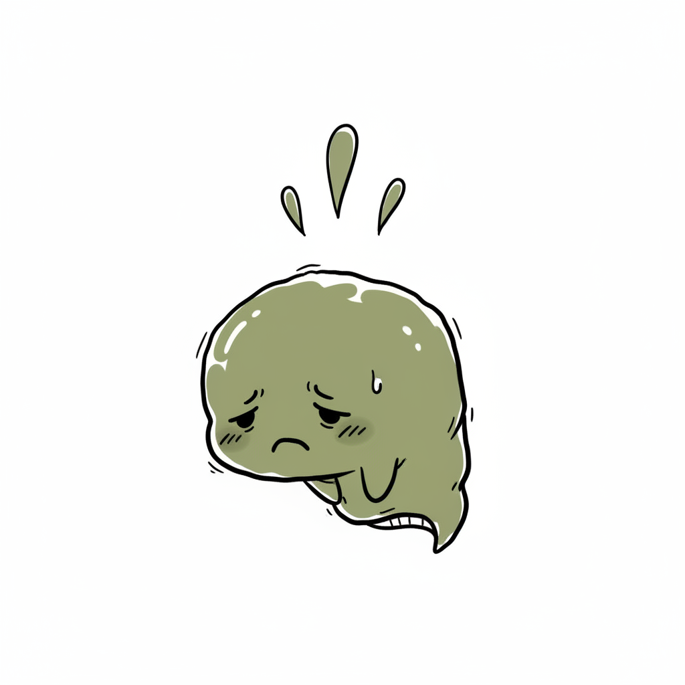<br>
<b>iPhone User</b><br>
<i>"Green bubbles are gross" / "My battery health is 84%"</i><br>
<a href="iphone-user.json">Download</a>
</td>
<td align="center">
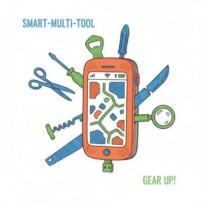<br>
<b>Android User</b><br>
<i>"Actually, Android did that first" / "It's not bloatware, it's features"</i><br>
<a href="android-user.json">Download</a>
</td>
</tr>
<tr>
<td align="center">
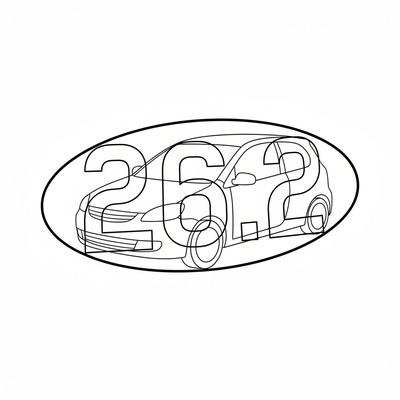<br>
<b>Marathon Identity</b><br>
<i>"Did I mention I ran a marathon?" / "Actually, 26.219"</i><br>
<a href="marathon-identity.json">Download</a>
</td>
<td align="center">
<br>
<b>The Shining</b><br>
<i>"All work and no play" / "Always been the caretaker"</i><br>
<a href="the-shining.json">Download</a>
</td>
<td align="center">
<br>
<b>Dark Tower</b><br>
<i>"The world has moved on" / "Blaine is a pain"</i><br>
<a href="dark-tower.json">Download</a>
</td>
</tr>
<tr>
<td align="center">
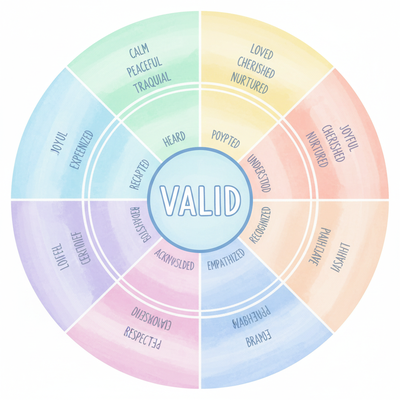<br>
<b>Therapy Speak</b><br>
<i>"That's valid" / "Healing isn't linear"</i><br>
<a href="therapy-speak.json">Download</a>
</td>
<td align="center">
<br>
<b>Performative</b><br>
<i>"Holding space" / "Protecting my energy"</i><br>
<a href="performative.json">Download</a>
</td>
<td align="center">
<br>
<b>I, Claudius</b><br>
<i>"Letting all the poisons hatch" / "Becoming emperor accidentally"</i><br>
<a href="i-claudius.json">Download</a>
</td>
</tr>
<tr>
<td align="center">
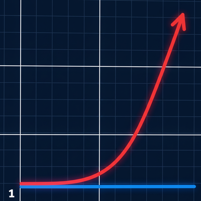<br>
<b>SQL Server</b><br>
<i>"Where are my scripts?" / "Estimating 1 row"</i><br>
<a href="sql-server.json">Download</a>
</td>
<td align="center">
<br>
<b>Layoff Speak</b><br>
<i>"Right-sizing the organization" / "Laptop return instructions"</i><br>
<a href="layoff-speak.json">Download</a>
</td>
<td align="center">
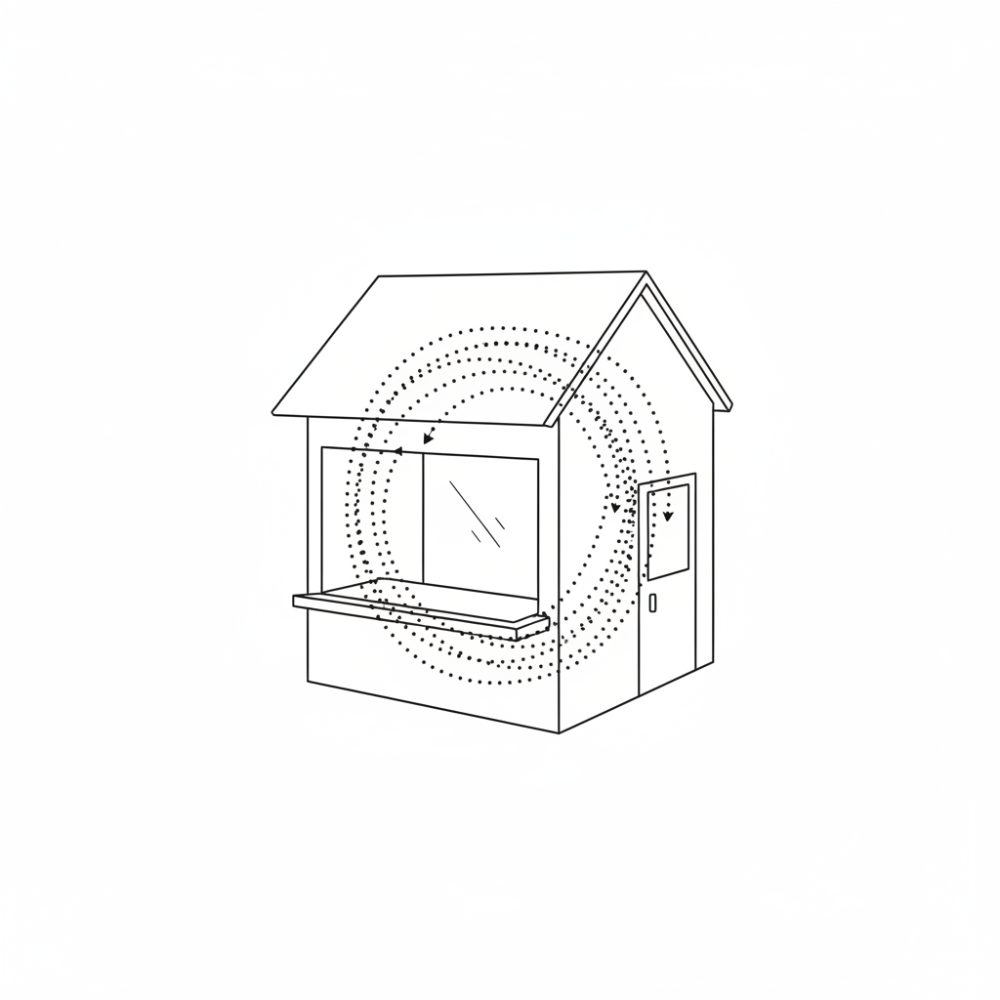<br>
<b>Small Store</b><br>
<i>"Walking the same loop again" / "Too far in to leave empty-handed"</i><br>
<a href="small-store.json">Download</a>
</td>
</tr>
<tr>
<td align="center">
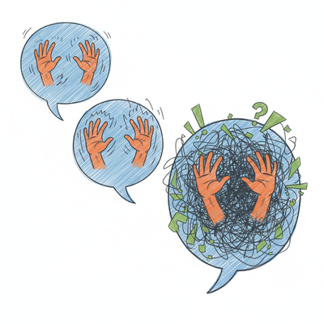<br>
<b>Ending Phone Call</b><br>
<i>"Thought we said goodbye" / "The triple bye"</i><br>
<a href="ending-phone-call.json">Download</a>
</td>
<td align="center">
<br>
<b>Week in France</b><br>
<i>"Raw milk cheese changed me" / "Bidet convert"</i><br>
<a href="week-in-france.json">Download</a>
</td>
<td align="center">
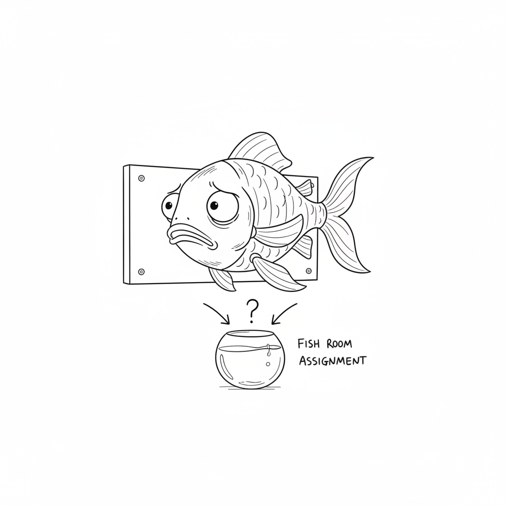<br>
<b>Dorinda Medley</b><br>
<i>"Slurring slightly" / "Assigning the fish room"</i><br>
<a href="dorinda-medley.json">Download</a>
</td>
</tr>
<tr>
<td align="center">
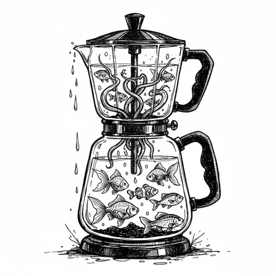<br>
<b>Twin Peaks</b><br>
<i>"There's a fish in the percolator" / "Speaking backwards"</i><br>
<a href="twin-peaks.json">Download</a>
</td>
<td align="center">
</td>
<td align="center">
</td>
</tr>
</table>

---

## Installation

Copy the `spinnerVerbs` block from any JSON file into your Claude Code settings:

**Windows:** `%USERPROFILE%\.claude\settings.json`
**macOS/Linux:** `~/.claude/settings.json`

```json
{
  "spinnerVerbs": {
    "mode": "append",
    "verbs": [
      "Your spinner messages here..."
    ]
  }
}
```

Restart Claude Code after editing.

**Mode options:** `"append"` adds to defaults, `"replace"` uses only yours.

---

## License

MIT
